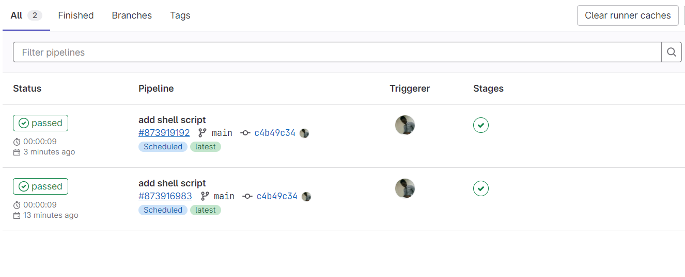
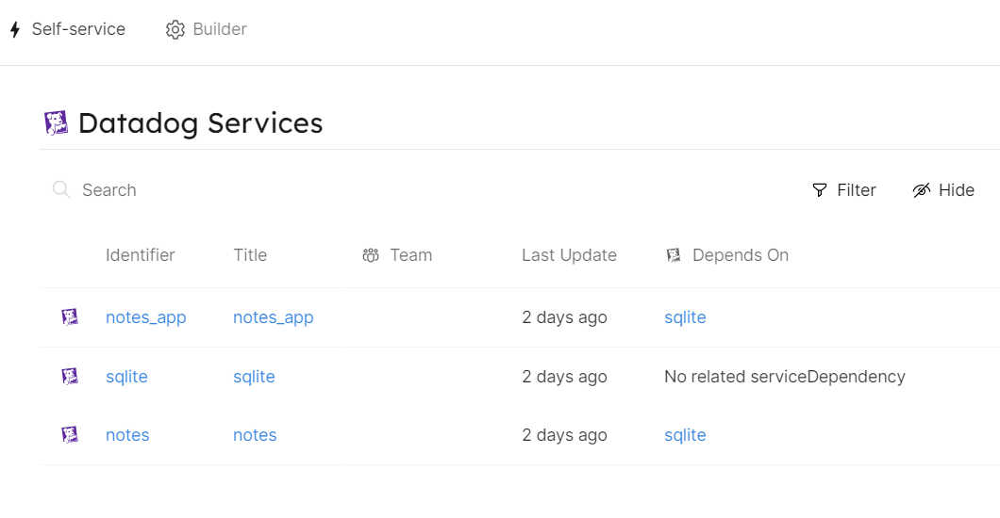

# Ingesting Datadog Service Dependencies

## Getting started

In this example, you will create a `service` blueprint that ingests all services and their related dependencies in your Datadog APM using REST API. You will then add some shell script to create new entities in Port every time GitLab CI is triggered by a schedule.

## Service Blueprint
Create the service blueprint in Port [using this json file](./datadog/service.json)

### Gitlab CI yaml
Place this example `.gitlab-ci.yml` file in your project's root folder

### Gitlab CI Variables
To interact with Port using Gitlab CI Pipeline, you will first need to define your Port credentials [as variables for your pipeline](https://docs.gitlab.com/ee/ci/variables/index.html#define-a-cicd-variable-in-the-ui). Then, pass the defined variables to your ci pipeline script. Please note that by deafult, all Datadog API clients are configured to consume Datadog US site APIs (https://api.datadoghq.com). If you are on the Datadog EU site, set the environment variable DATADOG_API_URL to `https://api.datadoghq.eu`. Some Datadog clients may require you to add your account region to the API. In this case, you may change the DATADOG_API_URL to `https://api.<region>.datadoghq.com` or `https://api.<region>.datadoghq.eu`

The list of the required variables to run this pipeline are:
- `PORT_CLIENT_ID`
- `PORT_CLIENT_SECRET`
- `DATADOG_API_KEY`
- `DATADOG_APPLICATION_KEY`
- `DATADOG_API_URL`
- `DATADOG_ENVIRONMENT_ID`

### Schedule the script
1. Go to your Gitlab project and select CI/CD
2. Click on **Schedules** and create new schedule
3. Enter the necessary information into the form: the Description, Interval Pattern, Timezone, Target branch and other variables specifically for the schedule.
4. Click on **Save pipeline schedule** 

#### Screenshot - Pipeline Success

#### Screenshot - Port Entity Created

